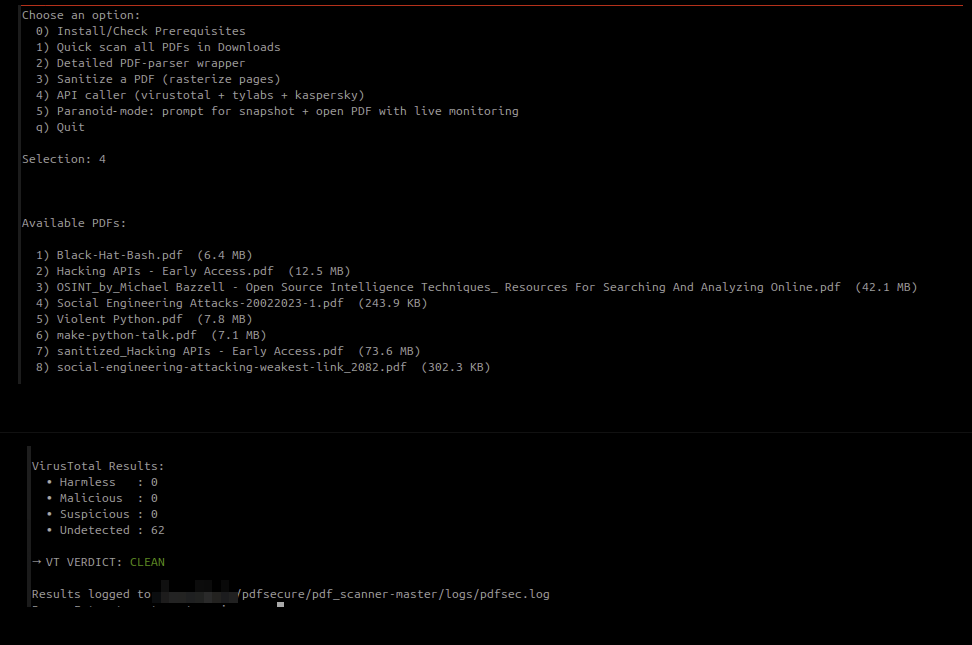

# PDF Security Scanner

Ubuntu / Python tool to scan PDF files in `~/Downloads` for potential security risks. 

Flags which files are safe to open and which are not with detailed report saved to file. 


# Project Dir: 

```bash 
~/pdfsec/
│
├── config
│   └── bootstrap.sh            # ubuntu prereqs installer 
│
├── logs
│   ├─ pdfsec.log               # master log 
│   └─ pcap/                    # PCAP captures (e.g. tcpdump)
│       └─ pcap_capture.pcap
│
├── modules
│   ├── api_caller.py           # VirusTotal, Kaspersky API caller 
│   ├── pdf-parser.py           # parser wrapper for DidierStevens Github's script 
│   ├── pdf_sanitizer.py        # Rasterize‐all‐pages and create new PDF  
│   └── quick_scan.py           # ClamAV, pdfgrep scanner 
│
├── paranoid_mode
├── quarantine
├── sanitizer
│   └── venv
│       └── *
│
└── scan_menu.sh                # main menu
```


--- 


# First Run 

Download zipped project, run bootstrap script first as root, second time as non root user: 

- `sudo bash bootstrap.sh` 
- `bash bootstrap.sh`


Run Bash Menu script `scan_menu.sh` which provides following options: 


```bash 
0) Install/Check Prerequisites                  # quickly checks if prerequstes are installed, creates venv and installs them if necessary 
1) Quick scan all PDFs in Downloads             # ubuntu based bash script utilizing ClamAV, pdftotext, exiftool
2) Detailed PDF-parser wrapper                  # utilizing DidierStevens pdf_parser script looking for “suspicious” keywords to search for in streams
3) Sanitize a PDF (rasterize pages)             # moves suspicious PDF to sanitized folder 
4) API caller (virustotal + tylabs)             # uses free API (account required) from virutotal and tylabs, to upload and check PDF 
5) Paranoid‐mode: open PDF in firejain sandbox  # with live network and OS monitoring + pcap capture and basic analysis 
```

**Quick Scan** 


**API caller**


### NOTE: 

For API caller an API Key from [virustotal](https://www.virustotal.com) & [opentip.kaspersky.com](https://opentip.kaspersky.com) is required. 

In modules/api_caller.py those two are required: `VT_API_KEY` & `KASPERSKY_API_KEY`

```python
# API KEYS (replace XXXX with API keys)
VT_UPLOAD_URL = "https://www.virustotal.com/api/v3/files"
VT_ANALYSIS_URL = "https://www.virustotal.com/api/v3/analyses"
VT_API_KEY = "XXXX"
KASPERSKY_SCAN_URL = "https://opentip.kaspersky.com/api/v1/scan/file"
KASPERSKY_RESULT_URL = "https://opentip.kaspersky.com/api/v1/getresult/file"
KASPERSKY_API_KEY = "XXXX"
```





All results and status messages are logged into singe logfile:

`~/pdfsec/logs/pdfsec.log`

 


--- 


# troubleshooting 

```bash 
# freshclaim manual update and lock cleanup 
sudo systemctl stop clamav-freshclam
sudo systemctl stop clamav-daemon
sudo rm -f /var/log/clamav/freshclam.log
sudo rm -f /var/lib/clamav/*.lock
```